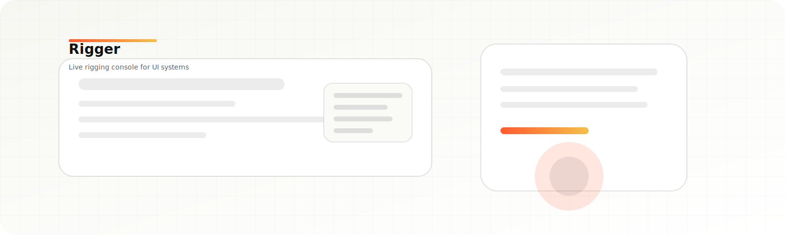
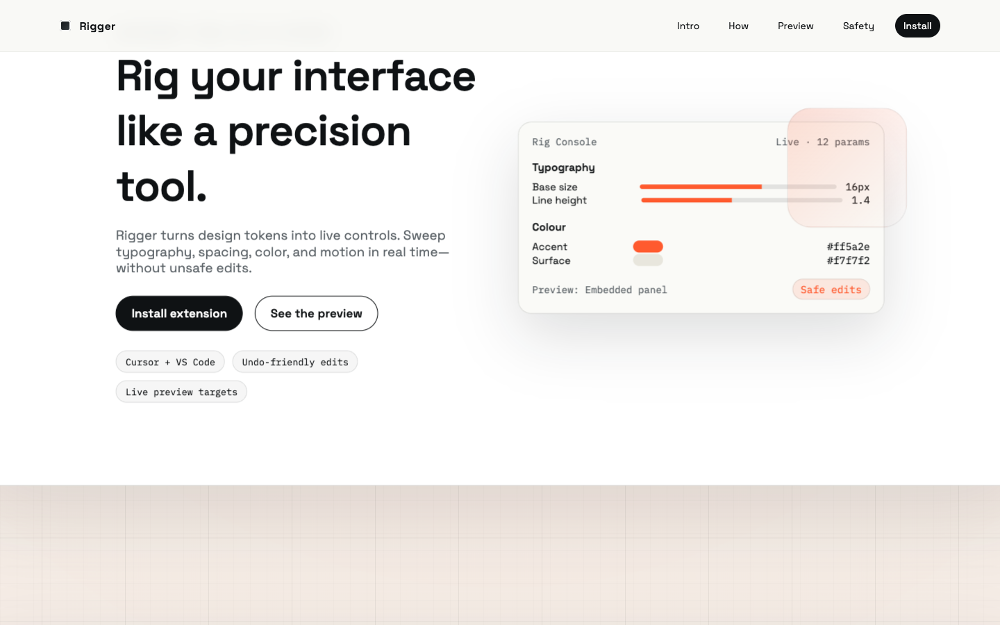
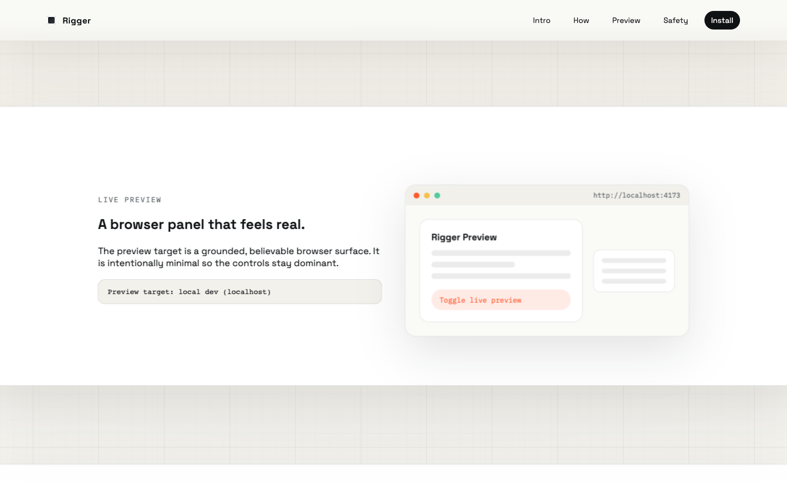
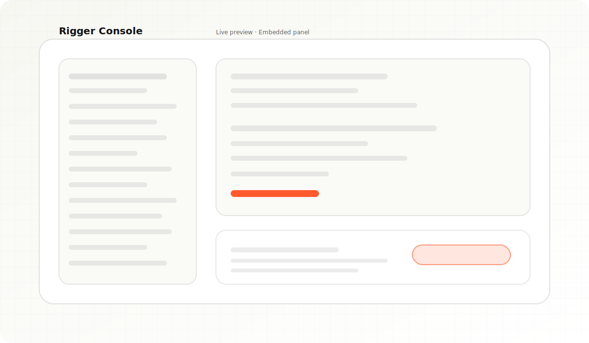
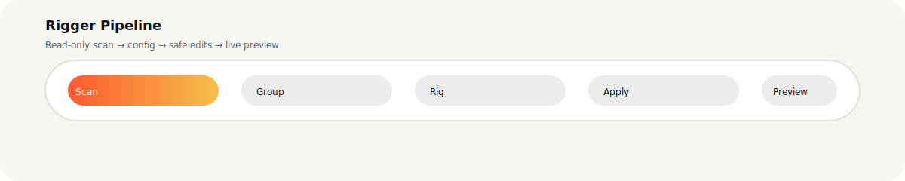

# Rigger

**Rigger is a live rigging console for UI systems.**

Turn design tokens into hands‑on controls. Sweep through typography, spacing, color, and motion in real time—without rewriting your app. It’s a developer‑grade instrument panel for visual systems: fast, precise, undo‑friendly, and built to feel like a power tool you’d miss the second it’s gone.

> Cursor‑compatible. VS Code native. Built for creative technologists, frontend engineers, and designers who ship.





[](https://becktothefuture.github.io/rigger/)

---

## Landing Page (GitHub Pages)

Source lives in `docs/landing/`.

**Live preview**
[GitHub Pages](https://becktothefuture.github.io/rigger/)

**Live URL**
`https://becktothefuture.github.io/rigger/`

**Local preview**
```bash
python3 -m http.server 4173 --directory docs/landing
```




**Panel callout**



## Why Rigger

Rigger makes UI systems **tweakable at the speed of thought**.

- **Explore** a codebase and discover tweakable parameters
- **Rig** them into a configurable control surface
- **Preview** changes live in your app
- **Export** clean config snapshots for teams

No brittle magic. No hidden file edits. Every change is a Workspace Edit you can undo.

---

## What It Does Today (v0.1)


- **Custom webview panel** inside Cursor/VS Code
- **Project detection** (React + vanilla JS)
- **Scan pipeline** that proposes tweakable parameters
- **Rig config generation** (`rig.config.json`)
- **Safe CSS variable hooks** (diff‑first, undo‑friendly)
- **Loupedeck‑like rig UI** (sliders + inputs + density)
- **Resizable panels** + persisted layout state
- **Live preview** options:
  - Cursor/VS Code preview (Simple Browser)
  - Embedded panel preview
  - External browser

---

## How It Works (Pipeline)



1. **Scan** the workspace (read‑only)
2. **Extract** candidate tokens and compute confidence
3. **Group** into riggable categories (Color, Typography, Spacing…)
4. **Generate** a config and variable hooks
5. **Apply** via WorkspaceEdit (undo‑friendly)
6. **Live preview** by updating CSS variable overrides

---

## Quick Start (Local Dev)

This is the fastest way to iterate without reinstalling the extension.

1. **Install deps**
   ```bash
   npm install
   ```

2. **Run watch mode**
   ```bash
   npm run watch
   ```

3. **Launch Extension Development Host**
   - Open `.vscode/launch.json`
   - Run **"Rigger: Extension Dev Host"** (F5)
   - The demo workspace opens automatically

4. **Open the panel**
   - Command Palette → `Rigger: Open Panel`

5. **Rig your project**
   - Click **Rig it up**
   - Adjust controls
   - Toggle **Live preview**

---

## Preview Targets

Rigger gives you a live preview target you can change on the fly:

- **Cursor/VS Code preview** — Simple Browser inside the editor
- **Embedded panel** — iframe inside the Rigger UI
- **External browser** — system browser

Set your preview URL, pick a target, and go.

---

## Tests

- **Unit tests** (rig engine)
  ```bash
  npm test
  ```

- **Integration tests** (VS Code test host)
  ```bash
  npm run test:integration
  ```

> Tip: close all other VS Code instances before running integration tests.

---

## Dev Workflow Notes

- Webview is a **Vite + React** app with HMR
- Extension host loads **localhost** in dev mode when `rigger.devWebview=true`
- All UI state is **persisted** (layout, density, last group)

---

## Guardrails (Non‑negotiable)

- **Read‑only scan first**
- **Confidence thresholding** (prefer high signal)
- **Diff‑first edits only**
- **Undo‑friendly** (WorkspaceEdit)
- **No remote script injection** (strict CSP)

---

## Repo Layout

```
src/                  Extension host (commands, workspace edits)
src/rig-engine/       Scanning + config generation
webview/              React + Tailwind + shadcn UI
webview/dist/         Bundled webview assets
demo/                 Demo HTML/CSS for onboarding
demo-workspace/       Sample workspace for dev host
test/                 Unit + integration tests
docs/                 Development + UI guidelines
```

---

## Roadmap

- **Onboarding polish** (delight + guided entry)
- **Riggable parameter expansion** (JS/TS parsing)
- **Project cards** + richer detection
- **Rig presets** + team sharing
- **Preview sync** with multiple running targets

---

## Contributing

We’re building a tool for people who ship UI. If you want to push it forward:

- Create an issue with a **clear repro** or **design note**
- Submit PRs that keep safety and clarity first
- Favor **explainable** automation over brittle heuristics

---

## License

License is **TBD**.

---

### Rigger is a rig. You steer it.

This is not a toy UI. It’s a console for real systems.
